# IFMS Material Management Module — Complete Database Schema & System Architecture

**Project:** IFMS Material Management Module (GNCTD)  
**Database:** `ifms_jk` (PostgreSQL 17)  
**Reference Frontend:** `ifms_material_management_V2.html`  
**Status:** All 43 tables successfully created in `ifms_jk` database.

---

## 1. Core Architectural & Standardized Rules

1. **Table Prefix & Character Limit**:
   - All Material Management tables use the prefix **`mtrl_`**.
   - Maximum table name length is **15 characters** (e.g., `mtrl_item`, `mtrl_variant`, `mtrl_party`, `mtrl_req_line`, `mtrl_invoice`).
2. **Primary & Foreign Key Types**:
   - **No UUIDs used for new tables**.
   - All primary keys use **`BIGSERIAL PRIMARY KEY`** (`BIGINT`).
   - All Foreign Keys between `mtrl_` tables use **`BIGINT`**.
3. **Mandatory Multi-Tenant & Organizational Audit Columns**:
   Every table contains standard enterprise scoping and audit fields:
   - `tenant_id` (`BIGINT REFERENCES tenant_master(tenant_id)`)
   - `branch_id` (`BIGINT`)
   - `entity_id` (`BIGINT REFERENCES entity_master(entity_id)`)
   - `department_id` (`INTEGER REFERENCES departments(id)`)
   - `office_id` (`INTEGER REFERENCES offices(id)`)
   - `financial_year_id` (`INTEGER REFERENCES financial_years(id)`)
   - `created_by` (`BIGINT`), `created_at` (`TIMESTAMPTZ DEFAULT clock_timestamp()`)
   - `updated_by` (`BIGINT`), `updated_at` (`TIMESTAMPTZ DEFAULT clock_timestamp()`)
   - `is_active` (`BOOLEAN DEFAULT TRUE`)

---

## 2. Core `ifms_jk` Integration Map (Reused Masters)

| Core `ifms_jk` Table | Primary Key | Linked In Material Module For |
| :--- | :--- | :--- |
| **`tenant_master`** | `tenant_id` (bigint) | State / Tenant scoping |
| **`entity_master`** | `entity_id` (bigint) | Autonomous bodies, Directorate, Corporations |
| **`departments`** | `id` (integer) | User department issuing indents or managing stores |
| **`offices`** | `id` (integer) | Field offices, DDO offices, Store locations |
| **`financial_years`** | `id` (integer) | Financial Year linkage for indents, plans, tenders, and budgets |
| **`budget_heads`** | `id` (integer) | Chart of Accounts Head validation (Major, Minor, Object Head) |
| **`tb_budget_balance_snapshots`** | `id` (bigint) | Budget reservation, commitment checks & balance updates |
| **`bm_scheme`** | `id` (integer) | Scheme alignment for developmental works and material procurement |
| **`bm_project`** | `id` (integer) | Project-level material requisition and issue tagging |
| **`code_master`** | `code_mst_id` (bigint) | Centralized workflow status codes (Draft, Approved, Dispatched, etc.) |
| **`branch_master`** | `branch_id` (bigint) | Bank branch mapping for EMD, PBG, and vendor disbursements |
| **`exp_treasury_bills`**| `id` (uuid) | Treasury Bill interface for 3-Way matched invoices |
| **`exp_treasury_vouchers`**| `id` (uuid) | Payment voucher and UTR reconciliation |
| **`audit_log`** | `id` (uuid) | Audit trail and compliance mutation logging |

---

## 3. Master List of 43 Created `mtrl_` Tables ($\le 15$ Chars)

| # | Table Name | Chars | Functional Purpose / Domain Model |
| :---: | :--- | :---: | :--- |
| 1 | **`mtrl_item_cat`** | 13 | Material Category & Sub-category Classification Hierarchy |
| 2 | **`mtrl_uom`** | 8 | Unit of Measurement Master (Nos, Kg, Metric Ton, Meters, Liters) |
| 3 | **`mtrl_uom_conv`** | 13 | Dual / Alternate Unit Conversion Ratios (e.g., 1 Box = 10 Nos, 1 MT = 1000 Kg) |
| 4 | **`mtrl_item`** | 9 | Base Item / Service Master (Goods/Services, Stockable, Returnable Tool, HSN, Tax, Image) |
| 5 | **`mtrl_variant`** | 12 | Item Variants (Sizes: 30/38/42, Colors, Brands/Makes: Tata/Dell, Material Variety, Tolerances, SKU) |
| 6 | **`mtrl_boq`** | 8 | Schedule of Rates & BoQ Conversion Mapping |
| 7 | **`mtrl_party`** | 10 | Unified Business Partner Master (Vendor / Customer / Both) |
| 8 | **`mtrl_party_ad`** | 13 | Multi-location Party Addresses (Billing, Factory, Warehouse, Registered) |
| 9 | **`mtrl_party_cn`** | 13 | Party Contact Directory (Key Management, Sales, Accounts) |
| 10 | **`mtrl_store`** | 10 | Central & Departmental Store / Warehouse Locations |
| 11 | **`mtrl_req`** | 8 | Material Requisition / Indent Header |
| 12 | **`mtrl_req_line`** | 13 | Requisition Line Items & Technical Specifications |
| 13 | **`mtrl_proc_pln`** | 13 | Departmental Annual Procurement Plan |
| 14 | **`mtrl_tender`** | 11 | Tender / RFP / Direct Purchase Bid Header |
| 15 | **`mtrl_quote`** | 10 | Vendor Quotations / Bids & Comparative Statement Matrix |
| 16 | **`mtrl_wo`** | 7 | Work Order / Purchase Order Header |
| 17 | **`mtrl_wo_line`** | 12 | Work Order Line Items & Delivery Schedules |
| 18 | **`mtrl_wo_amend`** | 13 | Work Order Amendments (Quantity Variation, Delivery Extension) |
| 19 | **`mtrl_delivery`** | 13 | Consignment Dispatch & In-Transit Tracking |
| 20 | **`mtrl_grn`** | 8 | Goods Receipt Note (GRN) Gate Inward Header |
| 21 | **`mtrl_grn_line`** | 13 | GRN Lines (Challan vs Received vs Accepted vs Rejected vs Excess) |
| 22 | **`mtrl_insp`** | 9 | Quality Inspection, Technical Lab Testing & Tolerance Clearance |
| 23 | **`mtrl_rtv`** | 8 | Return to Vendor (RTV) for Rejected / Damaged Goods |
| 24 | **`mtrl_stock`** | 10 | Real-Time Item & Variant Stock Balances by Store, Batch & Shelf |
| 25 | **`mtrl_movement`** | 13 | Bin-Card Ledger / Material Transaction History |
| 26 | **`mtrl_transfer`** | 13 | Inter-Store / Inter-Department Stock Transfers |
| 27 | **`mtrl_issue`** | 10 | Material Issue Voucher Header to Indentors / Projects |
| 28 | **`mtrl_iss_line`** | 13 | Material Issue Line Items with Batch/Serial Allocations |
| 29 | **`mtrl_return`** | 11 | Unconsumed Material Return to Store |
| 30 | **`mtrl_tool_iss`** | 13 | Daily Returnable Tools / Equipment Issue & Return (Labor/Workers) |
| 31 | **`mtrl_invoice`** | 12 | Vendor Commercial Tax Invoice Header |
| 32 | **`mtrl_match`** | 10 | 3-Way Matching Engine Record (PO vs GRN vs Invoice) |
| 33 | **`mtrl_security`** | 13 | EMD, Tender Fee & Performance Bank Guarantee (PBG) |
| 34 | **`mtrl_warranty`** | 13 | Equipment Warranty & AMC Tracking |
| 35 | **`mtrl_defect`** | 11 | Defect Complaints, Breakdown Incidents & RMA |
| 36 | **`mtrl_disposal`** | 13 | Scrap, Condemnation, E-Auction & Disposal Register |
| 37 | **`mtrl_audit`** | 10 | Physical Stock Verification & Stock Taking Audit Cycle |
| 38 | **`mtrl_audit_ln`** | 13 | Physical Stock Verification Lines (Book vs Actual vs Variance) |
| 39 | **`mtrl_adjust`** | 11 | Stock Discrepancy Adjustment & Write-off Voucher |
| 40 | **`mtrl_forecast`** | 13 | Consumption Analysis & Suggested Reorder Plan |
| 41 | **`mtrl_wf_cfg`** | 11 | Multi-Tier Workflow Stage Config & Escalation Matrix |
| 42 | **`mtrl_limit`** | 10 | Delegated Financial Powers & Procurement Limits |
| 43 | **`mtrl_notif`** | 10 | Real-Time Notifications, Triggers & Alerts Queue |

---

## 4. Key Business Logic Implementations

### A. Items, Services & Variant Matrix (`mtrl_item` & `mtrl_variant`)
* **Goods vs. Services**: Handles physical materials (Coal, Steel, Laptops) as well as contracted services (JCB excavation for 8 hours, equipment maintenance, transportation) via `is_service` and `item_type`.
* **Stockable vs. Returnable Tools**:
  * Consumable raw materials (`is_stockable = TRUE`, `is_consumable = TRUE`) update real-time stock and generate bin-card ledger entries.
  * Returnable instruments / tools issued to labor in the morning and returned in the evening (`is_returnable_tool = TRUE`) are tracked in **`mtrl_tool_iss`** without depleting consumable inventory.
* **Variant System**: Supports multiple attributes per base item:
  * **Size Variants**: 30, 35, 38, 42, 6mm, 10mm, 14-inch
  * **Brand / Make**: Tata, Mahindra, Dell, Philips, etc.
  * **Material Quality**: 100% Cotton, Silk, Mild Steel, Stainless Steel, Grade A Coal
  * **Color / Finish**: Galvanized, Powder Coated, Color codes
  * **Tolerance Limits**: Acceptable variation percentages (`tolerance_pct`) for weight and dimensions during quality inspection.
* **Dual / Alternate UOM**: Unit conversion ratios configured in **`mtrl_uom_conv`** (e.g., 1 Metric Ton = 1000 Kg, 1 Box = 10 Nos).

### B. Unified Business Partner Master (`mtrl_party`, `mtrl_party_ad`, `mtrl_party_cn`)
* Single table for both **Vendors (Suppliers)** and **Customers (Buyers)** via `party_type` (`VENDOR`, `CUSTOMER`, `BOTH`).
* Tracks GSTIN, PAN, MSME registration, Bank details, credit terms, multi-location factory/billing addresses, and key contact persons.

### C. Daily Returnable Tools & Equipment (`mtrl_tool_iss`)
* Dedicated log for tools, instruments, and safety gear issued to workers/laborers at the start of a shift and returned at shift end.
* Captures `worker_labor_name`, `worker_id_card`, `shift_name`, `tool_condition` (Working, Damaged, Lost), and damage fines if applicable.

---

## 5. Page-by-Page Screen & Button Mapping

| Screen / Route | Functional Buttons / Actions | Tables Used | Core `ifms_jk` Links |
| :--- | :--- | :--- | :--- |
| **Dashboard** (`dash`) | View KPI cards, alerts, pending tasks | `mtrl_item`, `mtrl_stock`, `mtrl_req`, `mtrl_wo`, `mtrl_grn`, `mtrl_invoice`, `mtrl_defect` | `financial_years`, `tb_budget_balance_snapshots`, `code_master` |
| **Material Master** (`mm/register`, `mm/create`, `mm/category`, `mm/uom`, `mm/boq`, `mm/bulk`) | Create Material, Add Variant, Map BoQ, Bulk Upload, Export Catalog | `mtrl_item_cat`, `mtrl_uom`, `mtrl_uom_conv`, `mtrl_item`, `mtrl_variant`, `mtrl_boq` | `departments`, `budget_heads`, `tenant_master` |
| **Requisitions** (`req/create`, `req/list`, `req/approvals`, `req/consolidate`) | Create Indent, Add Line Item, Submit for Approval, Approve/Reject Indent, Consolidate Indents | `mtrl_req`, `mtrl_req_line`, `mtrl_store`, `mtrl_item`, `mtrl_variant` | `financial_years`, `departments`, `offices`, `budget_heads`, `bm_scheme`, `bm_project`, `tb_budget_balance_snapshots` |
| **Procurement & Tenders** (`proc/plan`, `proc/tender`, `proc/quotes`, `proc/eval`, `proc/cs`, `proc/emd`, `proc/pg`) | Create Plan, Publish Tender, Upload Quotes, Evaluate Bids, Generate Comparative Statement, Award L1, Record EMD/PBG | `mtrl_proc_pln`, `mtrl_tender`, `mtrl_quote`, `mtrl_party`, `mtrl_security`, `mtrl_item`, `mtrl_variant` | `financial_years`, `departments`, `budget_heads`, `branch_master`, `code_master` |
| **Work Orders & PO** (`wo/create`, `wo/list`, `wo/amend`, `wo/delivery`) | Generate PO, Create Amendment, Track Dispatch, Update Milestone | `mtrl_wo`, `mtrl_wo_line`, `mtrl_wo_amend`, `mtrl_delivery`, `mtrl_party`, `mtrl_store` | `financial_years`, `departments`, `budget_heads`, `code_master` |
| **Receipt & Inspection** (`grn/list`, `grn/pending`, `grn/inspection`, `grn/rtv`) | Inward Consignment, Create GRN, Perform Quality Test, Generate RTV Gatepass, Post to Stock | `mtrl_grn`, `mtrl_grn_line`, `mtrl_insp`, `mtrl_rtv`, `mtrl_store`, `mtrl_item`, `mtrl_variant` | `departments`, `offices`, `code_master` |
| **Inventory & Movements** (`inv/stock`, `inv/movement`, `inv/transfer`, `inv/issue`, `inv/return`, `inv/reorder`) | View Bin Card, Issue Stock to Indentor, Transfer to Store, Return Unused Material, Daily Tool Issue/Return | `mtrl_stock`, `mtrl_movement`, `mtrl_transfer`, `mtrl_issue`, `mtrl_iss_line`, `mtrl_return`, `mtrl_tool_iss` | `departments`, `offices`, `bm_scheme`, `bm_project`, `code_master` |
| **Billing & Finance Interface** (`billing/invoice`, `billing/match`, `billing/initiate`, `billing/payment`) | Enter Vendor Invoice, Run 3-Way Match, Initiate Treasury Bill, Track UTR Payment | `mtrl_invoice`, `mtrl_match`, `mtrl_security`, `mtrl_party`, `mtrl_wo`, `mtrl_grn` | `financial_years`, `budget_heads`, `exp_treasury_bills`, `exp_treasury_vouchers` |
| **Warranty & Defects** (`warranty/list`, `warranty/defects`, `warranty/repair`, `warranty/escalation`) | Register Asset Warranty, Log Defect RMA, Vendor Investigation, Escalate to GeM | `mtrl_warranty`, `mtrl_defect`, `mtrl_party`, `mtrl_item`, `mtrl_variant` | `departments`, `offices`, `code_master` |
| **Disposal & Scrap** (`disp/proposal`, `disp/condemn`, `disp/auction`, `disp/register`) | Create Scrap Proposal, Condemn Asset, E-Auction Sale, Realize Proceeds | `mtrl_disposal`, `mtrl_item`, `mtrl_variant`, `mtrl_store` | `financial_years`, `departments`, `code_master` |
| **Stock Audit & Recon** (`audit/pv`, `audit/recon`, `audit/adjust`) | Initiate PV Cycle, Record Physical Count, Calculate Variance, Generate Write-off Voucher | `mtrl_audit`, `mtrl_audit_ln`, `mtrl_adjust`, `mtrl_stock`, `mtrl_movement` | `financial_years`, `departments`, `code_master` |
| **Demand Forecasting** (`fc/consumption`, `fc/forecast`, `fc/reorder`) | Run Consumption Trend, Generate Forecast, Create Suggested Indent | `mtrl_forecast`, `mtrl_item`, `mtrl_variant`, `mtrl_stock` | `financial_years`, `budget_heads` |
| **Administration** (`admin/workflow`, `admin/limits`, `admin/rules`, `admin/roles`) | Configure Workflow Stages, Set Delegated Financial Limits, Alert Triggers | `mtrl_wf_cfg`, `mtrl_limit`, `mtrl_notif` | `departments`, `code_master`, `tenant_master` |

---

## 6. End-to-End Relational Architecture Diagram

```mermaid
flowchart TD
    subgraph IFMS_Core ["Core IFMS Masters (ifms_jk)"]
        TENANT["tenant_master"]
        ENTITY["entity_master"]
        DEPT["departments"]
        OFFICE["offices"]
        FY["financial_years"]
        BH["budget_heads"]
        SNAP["tb_budget_balance_snapshots"]
        CODES["code_master"]
        SCHEME["bm_scheme / bm_project"]
        TBILL["exp_treasury_bills"]
        TVOUCH["exp_treasury_vouchers"]
    end

    subgraph Master_Catalog ["Material Master & Parties"]
        CAT["mtrl_item_cat"] --> ITEM["mtrl_item"]
        UOM["mtrl_uom"] --> ITEM
        UOM --> UOMCONV["mtrl_uom_conv"]
        ITEM --> VAR["mtrl_variant (Sizes/Colors/Makes/Tolerances)"]
        ITEM --> BOQ["mtrl_boq"]
        STORE["mtrl_store"]
        PARTY["mtrl_party (Vendor/Customer)"] --> P_ADDR["mtrl_party_ad"]
        PARTY --> P_CNT["mtrl_party_cn"]
    end

    subgraph Indent_and_Procure ["Requisitions to Work Orders"]
        REQ["mtrl_req (Indent)"] --> REQLN["mtrl_req_line"]
        ITEM & VAR --> REQLN
        REQ --> TND["mtrl_tender"]
        TND --> QUOTE["mtrl_quote"]
        PARTY --> QUOTE
        QUOTE --> WO["mtrl_wo (Purchase Order)"]
        WO --> WOLN["mtrl_wo_line"]
        WO --> AMEND["mtrl_wo_amend"]
        WO --> DELIV["mtrl_delivery"]
        TND --> SEC["mtrl_security (EMD / PBG)"]
    end

    subgraph Inward_and_Storage ["Goods Receipt, Quality & Inventory"]
        WO --> GRN["mtrl_grn"]
        GRN --> GRNLN["mtrl_grn_line"]
        GRN --> INSP["mtrl_insp (Tolerance & Lab Check)"]
        INSP -- Rejected --> RTV["mtrl_rtv"]
        INSP -- Accepted --> STOCK["mtrl_stock (Real-Time Balances)"]
        STOCK --> MOV["mtrl_movement (Bin Card Ledger)"]
        STOCK --> ISSUE["mtrl_issue / mtrl_iss_line"]
        STOCK --> TRANS["mtrl_transfer"]
        STOCK --> RET["mtrl_return"]
        STORE --> TOOL["mtrl_tool_iss (Daily Returnable Tools)"]
    end

    subgraph Settlement_and_Treasury ["3-Way Match & Treasury Settlement"]
        WO --> MATCH["mtrl_match (3-Way Match)"]
        GRN --> MATCH
        INV["mtrl_invoice"] --> MATCH
        PARTY --> INV
        MATCH -- Approved Bill --> TBILL
        TBILL --> TVOUCH
    end

    subgraph Lifecycle_and_Audit ["Post-Procurement Governance"]
        GRN --> WARR["mtrl_warranty"]
        WARR --> DEF["mtrl_defect (RMA Complaints)"]
        STOCK --> AUDIT["mtrl_audit / mtrl_audit_ln"]
        AUDIT --> ADJ["mtrl_adjust"]
        STOCK --> DISP["mtrl_disposal"]
        STOCK --> FC["mtrl_forecast"]
    end

    %% Scoping and Master Relations
    TENANT -.-> ITEM & REQ & WO & STOCK
    ENTITY -.-> ITEM & REQ & WO & STOCK
    DEPT -.-> ITEM & REQ & WO & STORE
    OFFICE -.-> REQ & WO & STORE
    FY -.-> REQ & TND & WO & INV & AUDIT
    BH -.-> REQ & TND & WO & INV
    SNAP -.-> REQ
    SCHEME -.-> REQ & ISSUE
```

